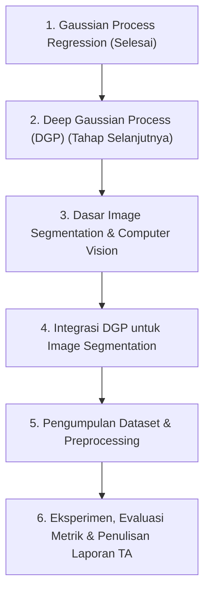

# Tugas Akhir (TA) - Image Segmentation with Deep Gaussian Process

Selamat datang di repositori Tugas Akhir! Repositori ini disusun secara rapi dan sistematis untuk mengorganisir alur pengerjaan Tugas Akhir mulai dari tahap pembelajaran teori hingga tahap implementasi akhir.

---

## 📌 Informasi Tugas Akhir
* **Topik/Judul**: Image Segmentation with Deep Gaussian Process
* **Fokus Utama**: Penerapan Deep Gaussian Process (DGP) untuk tugas Segmentasi Citra (Image Segmentation), memanfaatkan pemodelan ketidakpastian (*uncertainty estimation*) dan kemampuan representasi non-linear dari DGP.

---

## 🗺️ Roadmap Pengerjaan



---

## 📁 Struktur Direktori Repositori

```
TA/
├── README.md                           # Dokumentasi utama proyek & roadmap TA
├── 01_materi_belajar/                   # [FASE 1] Notebooks & materi eksplorasi teori
│   ├── 01_gaussian_process_regression.ipynb   # Catatan & kode Gaussian Process Regression
│   ├── 02_deep_gaussian_process.ipynb         # (Materi berikutnya) Deep Gaussian Process (DGP)
│   └── README.md                       # Rangkuman & panduan materi belajar
├── 02_eksperimen/                       # [FASE 1-2] Prototipe & eksperimen awal
├── 03_proyek_ta/                        # [FASE 2] Source code modular untuk sistem TA
│   ├── data/                           # Dataset citra (raw & processed)
│   ├── src/                            # Package Python (models, dataset loader, utils)
│   ├── checkpoints/                    # Bobot model terlatih (.pt, .pth, .ckpt)
│   └── train.py                        # Script utama pelatihan & pengujian
└── 04_dokumen_ta/                       # Dokumen pendukung TA
    ├── referensi_paper/                # Jurnal, paper, dan referensi riset
    └── catatan_bimbingan.md            # Log konsultasi & progres bimbingan TA
```

---

## 💡 Panduan Penggunaan
- Untuk **mempelajari teori dan eksplorasi**, buka folder `01_materi_belajar/`.
- Ketika siap melakukan **kodifikasi sistem utama**, gunakan arsitektur modular di folder `03_proyek_ta/`.
- Catat setiap hasil diskusi dosen pembimbing pada file `04_dokumen_ta/catatan_bimbingan.md`.
